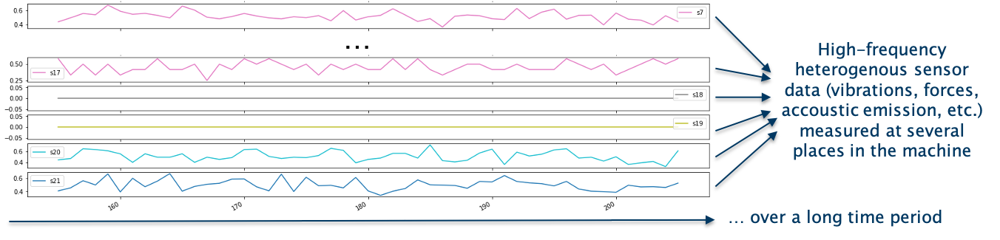
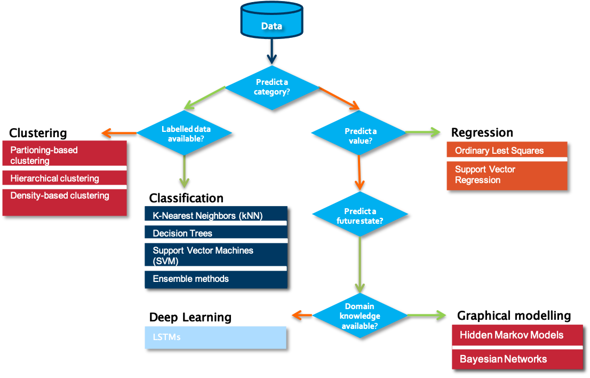
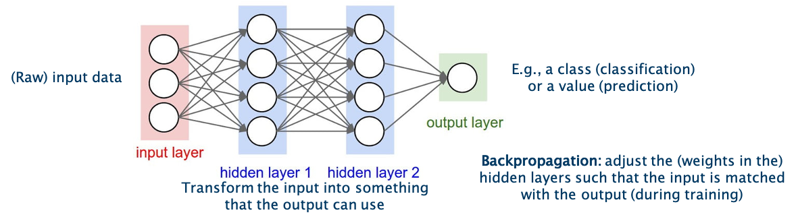

## Introduction
 

<iframe src="https://player.vimeo.com/video/595335197?h=51878aaf4c&color=e700ef"></iframe>

 

Welcome to the tutorial for the AI Starter Kit on remaining useful lifetime prediction!
In this first video we will provide an overview of the actual business case we’re tackling. We will introduce the most important concepts and explain why it is beneficial for maintenance to know the remaining useful lifetime of a machine, a tool or any other industrial asset.

 

Estimating the remaining useful lifetime of an asset can be beneficial for several purposes in a variety of industrial contexts. For one, it can offer support in the better scheduling of maintenance operations, for example for offshore wind turbines. For such assets, maintenance can only be performed under the right weather conditions.

 

But also for other assets, maintenance is an important part of its lifecycle. Traditionally, maintenance is done in a corrective way, such that it is performed at the moment an asset has failed. In that case, the failing part is identified and rectified or replaced, to ensure that the asset can subsequently resume normal operation.

 

Especially for strongly interdependent production lines or industrial assets operating in critical environments, an unplanned downtime is to be avoided and often costly. For this reason, more recently, for an increasing number of assets preventive maintenance is performed. In that case, maintenance tasks are scheduled at regular intervals, avoiding future asset failure to a maximum extent – but with the risk to replace assets that are still working correctly and still could for a while. Hence, the optimal time for replacement is wanted: The time when the asset still works correctly but will probably fail soon. And this is where the remaining useful lifetime comes into play.

 

Nowadays, ever more assets are equipped with different types of sensors gathering data.  This started the trend towards predictive maintenance, in which the maintenance moments are decided upon in a data-driven way. Therewith, maintenance is only performed when actually needed. This is a very broad domain which encompasses a variety of topics. Besides the estimation of the asset’s remaining useful lifetime – the main topic of this AI starter kit – further related problems to solve for a fully predictive maintenance approach are failure prediction, detection, and diagnosis for root cause analysis.

 

The remaining useful lifetime of industrial assets is defined as an estimate of the remaining time that an item, component, or system is estimated to function as expected. It is expressed as the number of hours, cycles, batches or any other quantity.

 

 

In the figure we see datapoints collected from an arbitrary sensor in green. Let’s say it measures the tool radius of a milling machine. With increasing time, the radius decreases as the tool wears out. At a certain point, the tool is considered too worn out to still further use it in production, which can influence the quality of the produced parts or lead to an unstable production process and consequent damage to the machine. The main questions thus is for how long the tool will it still be able to function properly?

 

By applying Machine Learning algorithms, the continuation of this time series data can be forecasted, denoted in pink. From this forecast, the remaining useful lifetime can be estimated for a given asset. In this case, the machine should be maintained within the next 10 to 15 cycles. With this information, maintenance tasks can be scheduled accordingly – with a tool still functioning and without unexpected downtime. Hence, by estimating the remaining useful lifetime, we minimize the risk of failure and maintenance cost.

 

An accurate prediction of an asset’s lifetime can also help to optimise the operational efficiency of an asset, by more optimally planning the use of that asset before its end of life, or adapting its operational use to extend its useful lifetime. In manufacturing settings, where a downtime of the production line results in several operational problems and associated costs, remaining useful lifetime prediction can avoid unplanned downtime.

 

In this AI Starter Kit, we will show its use to avoid safety-critical situations, by illustrating the solution methodology for predicting the remaining useful lifetime of aircrafts engines.

 

To summarize, by applying predictive maintenance it is possible to:
- better schedule maintenance operations
- optimize operational efficiency
- avoid unplanned downtime
- anticipate and avoid safety-critical situations.

 

This analysis can be performed for various machines, tools or processes as long as this degradation over time can be measured accordingly, just like resistance, length, temperature or similar measures.

 

Predicting the remaining useful lifetime is typically very challenging for several reasons:
First of all, usually a multitude of heterogenous sensor data is measured at several places in the machine. This data is often captured at a high-frequency, consisting of vibration data, acoustic emission, accelerometer data, and many more machine-internal parameters. Secondly, in some settings, also characteristics of the surrounding environment influencing the lifetime of the asset are captured. Further, typically, data that is gathered over a long period of time needs to be available to train the model. Given that industrial assets are often very complex – as they consist of both electrical and mechanical components - it generally is a non-trivial exercise to predict their end of life. On top of that, the data typically comes with a lot of variation, due to varying machine types operating in heterogenous operating conditions with different machine configurations.

 

 

Therefore, the main challenge in this process is to extract meaningful characteristics that can be used to predict the end of life from the gathered data. This is complicated by the fact that usually very little domain expertise on the operating conditions of these assets is available. Additionally, the environment in which they operate is typically very dynamic.

 

In this AI Starter Kit, we will guide you through a data-driven methodology based on deep learning to tackle this challenge.
In the next video, we will concentrate on the data itself that we selected to illustrate the approach. We will explain which information is available and what we can learn from it.

 
## Data Understanding

 

<iframe src="https://player.vimeo.com/video/595330939?h=29389f5469&color=e700ef"></iframe>

 

Welcome to the second video of the tutorial for the AI Starter Kit on remaining useful lifetime prediction! In this video, we will detail the dataset that will use and perform an initial data exploration to extract some first insights.

 

In this AI Starter Kit, we will work with a publicly-available dataset from NASA. The data simulates run-to-failure data from aircraft engines. These engines are assumed to start with varying degrees of wear and manufacturing variation - but this information is unknown to the user. Furthermore, in this simulated data, the engines are assumed to be operating normally at the beginning and start to degrade at some point during operation. The degradation progresses and grows in magnitude with time. When a predefined threshold is reached, the engine is considered unsafe for further operation. In other words, the last operational cycle of the engine can be considered as the failure point of the corresponding engine – meaning that the remaining useful lifetime has decreased to zero.

 

 

Before we can start with learning an actual machine learning model, it is crucial to understand the data itself. The data set consists of multiple time series with the "cycle" variable as time unit. For each engine, identified by the variable “id”, a different number of cycles is captured as not all engines fail at the same time. Per cycle, the following information in gathered: On the one hand, 21 sensor readings given by the data points s1 to s21. On the other hand, additional information about the machine settings, given by setting1 to setting3.

 

 

In machine learning experiments, a dataset is often split in a training set and a test set. This split allows one to quickly evaluate the performance of an algorithm. The training dataset is used to prepare a model, to train it. For evaluation, the test dataset  can be understood as new data that is presented to the algorithm. It was not seen by the algorithm before and therefore the outcome is unknown. In our example, it is data from different engines for which it is unclear when they are going to fail, or put differently, what their remaining useful lifetime is. For the purpose of evaluation, the information about the actual failure of the test data set is collected in the so-called ground truth data. This information will not be visible to the algorithm but will only be used for calculating the quality of the model.  

 

Now let’s have a look at the single sensor measurements. We see that the value range of the single measurements are quite different, without knowing in detail what they correspond to in a sense of physical measurement.

 

In the graph, we see the first 50 entries of time series data collected from three different sensor channels for engine 18. All three show some fluctuations but no clear deviation from a mean value indicated by the gray dotted lines, that could be a sign of degradation in engine performance, are visible. With increasing observation time, all three time series deviate more or less strongly from the mean values observed in the first 50 data points given by the gray horizontal line, indicating the start of the degradation process of the engine. For different engines, the deviation starts at different times. For engine 18, the deviation starts approximately at time 100. For engine 31 though, hardly any deviation is visible in the same time range. Only when increasing the time range, the clear deviation becomes evident. The different starting points of degradation for the single engines indicate that the simulations are made for engines with different wear.

 

In the next video, we will go into more detail into the data preprocessing phase, explaining how the data needs to be prepared such that it can be served as input for a machine learning learning algorithm.

 

If you are not familiar with deep learning, we recommend you to first watch our introductory video on this topic, in which we discuss the difference between ‘traditional’ Machine Learning algorithms and Deep Learning techniques. We will also provide a brief introduction to the different type of neural networks, amongst others the so-called Long Short-Term Memory networks or LSTMs for short, which is the type of network that we will use to solve this problem.

 
## Deep Learning Theory

 

<iframe src="https://player.vimeo.com/video/595326087?h=1f64dbe31e&color=e700ef"></iframe>

 

Data Science, Machine Learning, Deep Learning, Artificial intelligence… These words are often used interchangeably in different contexts and not always precisely. Therefore, before we continue with our particular use case, we will provide you with a brief introduction into the difference between “traditional” machine learning methods and Deep Learning-based techniques. Subsequently we will introduce you to the main neural network types that are used in deep learning, and explain you we selected the appropriate type for use in the context of remaining useful lifetime prediction.

 

 

When starting on a data science problem, you usually need to start with finding the answer to a number of questions before starting the hands-on work on the data. Without understanding the use case, even the best data science model will not help. In most cases, a particular business problem can mapped onto one of the following data science tasks. A first question to answer in that respect is which type of outcome is expected from the use case owner.

 

Is the aim to predict a category, such as ‘normal’, ‘degrading’ or ‘failed’? If yes, the next question to answer is whether labelled data is available or not. Labelled data is data for which examples are available that are annotated by a domain expert with one the classes to predict. Put differently, for each data point or set of data points, a class is defined. Usually, the number of unique classes is rather small. This data will be used by the algorithm for training a model. Once trained, it can be evaluated on a test data set, for which the classes are known but will not be visible to the model. Evaluating the ratio of correctly predicted classes gives a measure of the quality of the model. Often used algorithms for classification are k-Nearest Neighbors, Decision Trees or Support Vector Machines.

 

But what can we do if we don’t have information available on possible classes? In that case, introducing a similarity between the examples that you have available makes it possible to cluster different data points into groups. These groups can then be used to gain deeper insights into the data, and in some cases can be mapped to particular classes. Partition-base clustering, hierarchical clustering or density-based clustering are often used techniques for this purpose.

 

The situation is different in case a numerical value should be predicted. It is similar to the classification task, but the prediction range is continuous. For these so-called regression tasks, Ordinary Least Squares or Support Vector Regression are often used.

 

If the goal is neither to predict a class nor a numerical value, but rather a future state, one typically turns to graphical modelling algorithms order to predict these states. These techniques also allow one to include the available background knowledge into the modelling process. Examples of graphical modelling techniques are Hidden Markov Models and Bayesian Networks.

 

To make the difference between the single categories a bit clearer, we discuss some examples:

 

- In case no labelled data is available, clustering of data points can provide insights in different modes in the data. An example is a performance benchmarking of industrial assets. Let’s assume the data to analyze comes from a wind turbine park. When looking at several measurements, like for example of the power curve, the wind speed, and the wind direction, we can identify different modes in which the single wind turbines are operating.
- In contrast, assume that we are interested in the expected power production of a particular wind turbine in the following days for which we have a weather forecast. We can use this information as input variables for a regression model and therewith predict the power production.
- If labels are attached to the gathered data, for example on the root cause of particular sensor failures, a classification algorithm can be used to train a model that is able to determine which fault is associated with a certain set of sensor readings.
- When next to the data also background knowledge from a domain perspective is available, graphical models can for example be used to diagnose the reason behind a particular fault in industrial assets such as wind turbines.

 

 

How do the above examples differ from Deep Learning and when does it make sense to use the one or the other? One of the major constraints in traditional machine learning is given by the fact that domain knowledge is usually needed in order to perform proper feature extraction. Consequently, feature engineering is typically a manual and time-consuming task, requiring the necessary domain knowledge. There is hardly any case in which a model can be applied to the data as it is and receive good results. In a number of cases, however, the domain knowledge on a particular problem setting is limited or the machine or process generating the data is highly complex, making it hard for an expert to manually come up with useful characteristics that can be used as features for a machine learning model. This is where deep learning comes into play. In deep learning, the feature extraction and selection step is basically performed by the algorithm itself.

 

 

The technique is inspired by the neural networks in human brains. It should learn by itself how to combine the different neurons in the single layers in order to obtain the best results.  The learning is performed by the adjustment of the weights between the neurons in single layers. In the figure, these weights are symbolized by the arrows going from one neuron in one layer to another neuron in the next layer. The final result is given by the output in the output layer, indicated in green in the figure. The textbook example is the classification of images of animals, to discern cats from dogs.

 

 

Nowadays there is a whole spectrum of different model architectures and flavours of neurons depending on the type of task that is supposed to be solved. The choice for a particular type of network typically depends on the problem you want to solve, the characteristics of your input data and the availability of particular domain knowledge. All these factors influence amongst others the complexity of the network, its interpretability and the learning speed.

 

 

One of the simplest models is a so-called feedforward neural network as shown in the figure. As the model learns by adjusting the weights between the layers, the weights can be seen as its memory. While such models perform well for quite a number of problems, one downside is that their memory is rather static, due to which they have a hard time in ‘remembering’ patterns that happened a long time ago. Suppose that you need to learn a model to predict the sales of Christmas trees. It might be clear that hardly any Christmas tree will be sold in summer, and the main indicator for the sales this year will be the sales figures of the previous years in the month before Christmas. Remembering this long-term information is not easy for a feedforward neural network.

 

 

One way to overcome this problem is the usage of so-called Long Short-Term Memory - or LSTM in short - networks. As the name already indicates, LSTM networks are able to adapt their memory in a more precise way than feedforward neural networks, and in this way are better able in deciding which information they need to remember for a longer period of time.
LSTM networks are often used to solve tasks such as unsegmented, connected handwriting recognition, speech recognition and anomaly detection in network traffic or intrusion detection systems.

 

Also in the field of remaining useful lifetime, the implementation of LSTM networks is reasonable as we deal with data for which the change over time of several variables is decisive. Our interactive starterkit offers the possibility to build your own LSTM model. It allows to gain a deeper understanding of the different parameters and examine how they influence the prediction result.

 
## Data Preprocessing

 

<iframe src="https://player.vimeo.com/video/595333767?h=4fc4eaa9dd&color=e700ef"></iframe>

 

Welcome to the fourth video of the tutorial for the AI Starter Kit on remaining useful lifetime prediction! In this video, we will explain you how the data needs to be preprocessed such that it can be served as input for a machine learning algorithm.

 

Let’s get back to the NASA Engine data and our use case.
Before we can start with training a model to predict the remaining useful lifetime, a number of preparatory steps need to be taken. First of all, let us assign which type of problems we are dealing with. What precisely are we interested in? Is it about predicting a categorical value, which can take only a limited set of possible values, or a number?

 

 

Indeed, it’s not so easy to answer. It depends on how we define our use case: We can either ask: How long is the remaining useful lifetime? Then, a real number is looked for, and we deal with a so-called regression task. Alternatively, we can ask: Will the engine fail within the next 50 cycles? Then this boils down to a so-called binary classification task, in which the prediction is ‘yes’ or ‘no’. The choice for one or the other task mainly depends on the business question you want to solve. In most cases, a binary classification problem is easier to handle for a Machine Learning algorithm and therefore, this is the question we will answer in this AI Starter Kit. However, the solution methodology is largely similar when you would opt for predicting the remaining useful lifetime using regression.

 

In the previous video, we explained that for classification tasks, labelled data is essential. Therefore, as a first step, we need to create the binary labels: Has the machine failed within a given period of time or not?

 

 

For the training data, we know that the final cycle per engine id is the time of failure.
In order to determine the remaining number of cycles at each time point, first the maximum number of cycles per engine is determined. Subsequently, the current cycle number is subtracted from the maximal number of cycles to arrive at the number of cycles remaining at a particular time point.
[Can we visualize this nicely on a screen on an example? à Show a timeline next to the dataframe, annotated with max/number of cycles/labels]

 

 

We will add this value as a new variable to the data. However, this is not yet a binary label that can be used as input for the classification model we want to train. This is created by determining whether the calculated remaining useful lifetime is smaller than or equal to the threshold N – the period of time we want to predict the failure in. In this tutorial, we will use 30 cycles as a threshold, meaning that we aim to answer the question whether or not the engine will fail within the next 30 cycles at a particular point in time.

 

 

This binary label can now be used as input value for the classification model. In order to decide on the goodness of the model, the test data needs the same type of label. In that case though, the final cycles per engine does not automatically determine the time of failure. How can we proceed instead?

 

The ground truth data helps in this case. By joining the unlabelled test data and the ground truth data, we know the time of failure. Once done, we can analogously to the training data calculate the binary label for the test data. Don’t forget, these labels will only be used for evaluating the model and are not shown to the algorithm beforehand.

 

 

A second observation that can be made from the training data sample is that the scales of the values differ significantly across columns – both for sensor values and machine settings. This difference in the scale of the numbers could cause problems when the model needs to calculate the similarity between different cycles - namely the rows in the table - during modeling. To address this problem, we will normalize the data. The goal of normalization is to change the values of numeric columns in the dataset to use a common scale, without distorting differences in the ranges of values or losing information. The normalized values maintain the general distribution and ratios in the source data, while keeping values within a scale applied across all numeric columns used in the model.

 

One of the most popular normalization techniques is so-called Min-Max normalization and that is also what we will use here. It scales the values of a variable to a range between 0 and 1 using this formula

 

 

where 𝑋 represents the value to be normalized, 𝑋𝑚𝑖𝑛 is the minimum value of the variable in that column and 𝑋𝑚𝑎𝑥 is the maximum value for that variable
We apply the normalization on both the training and test data set on all sensor measurement and setting variables. We will not rescale the engine id, as it should be seen as a categorical variable. Further, for the cycle variable we keep both the original and the scaled values.

 

 

In the next video, we will go to the core of this tutorial, namely using a deep learning algorithm to train a model that is able to solve this binary classification problem.

 
## Data Modelling and Analysis

 

<iframe src="https://player.vimeo.com/video/595332448?h=e9c8629323&color=e700ef"></iframe>

 

Welcome to the fourth and last video of the tutorial for the AI Starter Kit on remaining useful lifetime prediction! In this video, we will explain you in detail how a deep learning algorithm can be used to train a model that is able to determine if an aircraft engine is entering the last 30 cycles of its remaining useful lifetime.

 

 

In the introductory video to Deep Learning, we discussed the difference between Machine Learning and Deep Learning. One of the main differences was given by the need of feature extraction. This can be a very time and knowledge demanding task. As we will concentrate on LSTMs in this AI starter kit, fortunately this step is taken care of by the deep learning algorithm itself.

 

Nevertheless, some data modelling is necessary beforehand. As a first step in the modelling phase, we will prepare the data to serve as input for the LSTM network. When using LSTMs in the time-series domain, one important parameter to pick is the sequence length which is the window for LSTMs to look back in time.

 

We discussed already in the data understanding video how differently the single variables for a given engine behave and consequently that the time when the degradation becomes visible is different for different engines. Hence, the window size chosen for the training data strongly influences the classification results. In order to model the data for training the algorithm, we first need to reshape the input information. So far, the data consists of the sequential measurements for each of the sensors and settings over time, engine per engine, meaning that one row per cycle and engine is given in the table. This format is however not so suitable for an LSTM model. Therefore, we create a matrix in the format (samples x sequence length x features), where 'samples' is the number of sequences that we will use for model training, ‘sequence length’ is the look back window as discussed before and 'features' is the number of input values of each sequence at each time step. In our case, we selected all sensor values, as well as the 3 settings parameters and the (normalised) current cycle the machine is in at this point.

 

With the data finally prepared, how can we now actually implement the LSTM architecture? Fortunately, there is no need to start from scratch but there are several open-source tools available that support you when building Deep Learning models. Keras is a deep learning library written in Python. It acts as an interface to the popular tensorflow library. This makes the implementation a lot more feasible.

 

In the AI Starter Kit though, this is even simpler. Instead of implementing the Deep Learning network yourself, an easy-to-use interface was set up, to adjust the most important variables of the neural network. Once you decide that the parameters specified for building the model are correct, you simply push the “Train model” button at the bottom of the page and the whole implementation and model training is done automatically.

 

Of course, it is also possible to modify the different parameters directly in the code. For more information on the meaning of each of the settings, you can have a look at the documentation page of Keras. Note that modifying the parameters outside of the scope that is defined in the interactive module can heavily influence the training time and the classification quality. So now it’s time to build your own deep learning model.

 

First of all, select the number of intermediate or so-called ‘hidden’ layers. For this first experiment, we select one single intermediate layer only. We set its size to 30 neurons. This corresponds to a rather small network but will be sufficient for a first test. As discussed, we need to decide on the size of the look back window as well. In this first test, we will use a sequence length of 50 cycles. Furthermore, we add a dropout layer after each LSTM layer. The dropout consists in randomly setting a fraction rate of neurons to 0 at each update during training time. This helps preventing overfitting. We choose a value of 0.2 for this first experiment. Finally, we need to select the number of epochs to train. The epochs define the number of times to iterate over the training data arrays. The aim is that the model improves during each training epoch. In general, the more epochs, the better the results until we reach the given model's limit. Here, we will use 15 epochs. This model can now be trained.

 

Now that we have a trained model, we can evaluate its performance. We will first evaluate it on the training data and subsequently on the test data. If both evaluations result in approximately the same score, this gives an indication that the model is generalizable to unseen datasets and thus not overfitting on the training data. In the interface, we switch to the tab Evaluation on the top of the animation to get more insights into the quality of the trained model. Pushing the button “Evaluate model” will lead to the evaluation of the last trained model.

 

 

Depending on the use case, different evaluation metrics can be important. Therefore, we will on the one hand evaluate the model in function of accuracy, which measures the fraction of all instances that are correctly categorized. More formally, it is the ratio of the number of correct classifications to the total number of correct or incorrect classifications. On the other hand, we also show the so-called confusion matrix. The confusion matrix shows that the model is able to correctly classify that a specific engine is not going to fail within N cycles for almost all of the more than 12,000 samples. Vice versa, the model is able to correctly classify for almost all of the more than 3000 cases that a specific engine is going to fail within N cycles.

 

In the summary table at the bottom of the page, several additional metrics are shown. Take your time to go through them once you run these experiments yourself.
Note that this evaluation is performed on the training data. In order to evaluate the model against the unknown data, we continue to the next tab in the interface. In this case, the same evaluation as before is performed but on the test data. Also here, the results are promising.

 

Now run an experiment yourself. For this, chose the following parameters and rerun the pipeline while pausing the video.

 

 

Did it work properly? Congratulations!
The only differences between the two experiments are the number of layers and their corresponding sizes.
Which difference do you observe? Compare the results in the tables in both tabs - evaluation and testing. When comparing the two models, which one would you use and why?

 

We hope that you have gained more insights in the key factors that influence the quality of a deep neural network and are familiar now with the usage of the interface. We suggest that you try different combinations of settings and think about in which way they influence the quality of the model.

 

In the next video, we will summarize the key take away messages and provide you with a number of suggestions for additional experiments to gain additional insights.

 
## Key Take Away Messages

 

<iframe width="600" height="336" src="https://www.youtube.com/embed/6yr0thvqMI0" frameborder="0" allow="accelerometer; autoplay; clipboard-write; encrypted-media; gyroscope; picture-in-picture" allowfullscreen></iframe>

 

In the video tutorial for this AI Starter Kit, we covered the basics of using deep learning for remaining useful lifetime prediction, which is one of the central topics in predictive maintenance. We illustrated the approach on the use case of predicting the remaining useful life of aircraft engines based on run-to-failure data. In doing so, we have taken you through the different steps in the data science workflow.

 

We started with the business and data understanding, which allowed us to gain more insights into the specific problem to solve and the structure of the data. Based on this information, we continued with the data preprocessing, in which we explained how to appropriately prepare the data. This included the construction of a training, test and validation set to learn and evaluate a model to predict whether an engine will fail within a certain number of operational cycles.

 

In the video on data modelling and analysis, we showed you how to use deep learning to construct a model for remaining useful life prediction. In particular, we applied a deep learning approach called long short-term memory (LSTM) networks which allows the construction of a predictive model without the time-consuming feature engineering step. This voided the need to manually extract the characteristics from which the algorithm can learn. Finally, we also explained you how to experimentally validate the resulting model and compare the results of different models.

 

While the use of deep learning in some cases might eliminate the need for manual feature engineering, it remains important to tune the models with the appropriate parameter settings, which requires the necessary effort. While the presented approach already gives promising results, there are still quite some improvements possible. Therefore, we recommend you to further try tuning the different parameters, and study the effect on the results. You can also continue to experiment with different network architectures, for example by altering the number of layers and nodes.

 

If you want to gain deeper insights in remaining useful lifetime prediction, a good exercise is trying to cast the prediction problem as a regression or multi-class classification task instead of as a binary classification task. It might also be worth to experiment with the methodology on a larger dataset with a higher number of assets or to try to adapt the different steps to the context of your own dataset.

 

While the details of each of the steps might differ, the methodological steps we presented are typically the required phases you need to go through when solving a remaining useful lifetime prediction model.

 

We thank you for completing this video series and hope to welcome you in another AI Starter Kit tutorial.
