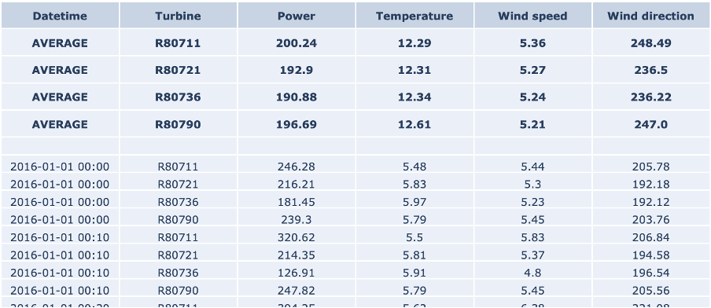
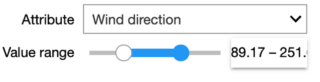

## Introduction
 

<iframe src="https://player.vimeo.com/video/596619071?h=ccbb7e33ba&color=e700ef"></iframe>

 

Welcome to the tutorial for the AI Starter Kit on time-series pre-processing. In this first video we will provide an overview of the actual challenge we’re tackling. We will introduce the most important problems occurring in time series data and explain why it is beneficial to first improve your data before you start any other data-modelling tasks.

 

Time series are characterised as a collection of data points obtained at successive times, most often with equal intervals between them. Since an increasing amount of assets is instrumented with sensors, this type of data is omnipresent, for example when monitoring industrial machinery or resulting from wearables tracking one’s health state. Depending on the application domain, time series data is exploited for various purposes. It is used, amongst others, for profiling energy consumption of households predicting imminent failures of a production line, estimating the remaining useful lifetime of a machine, and many more industrial use cases.

 

Typically, time series data cannot be used easily as-is by machine learning algorithms. This can be for example due to data quality issues such as missing values and sensor misreadings. Or because some algorithms are not fit to deal with the continuous nature of this type of data or the associated - often high – frequency with which it is gathered.

 

To illustrate the various methods and techniques in this Starter Kit, we will use a publicly available real-world dataset that consists of sensor data measurements from wind turbines. It exhibits typical characteristics of industrial time series datasets as it is very noisy and contains outliers and missing values.

 

Moreover, it exhibits seasonal patterns across multiple years, as the machine behaviour is influenced by the meteorological conditions.

 

We will use this dataset to illustrate
* how resampling and smoothing can be applied to gain a better understanding of the behaviour of the time series,
* how the quality of the data can be improved through normalization and outlier detection, and
* how missing data can be imputed in various ways.

 

In the next video, we will perform some initial exploration on the dataset in order to gain some basic understanding of the data.

 
## Data Understanding
 

<iframe src="https://player.vimeo.com/video/596619454?h=55827a6e24&color=e700ef"></iframe>

 

Welcome to the second video of the tutorial for the AI Starter Kit on time-series pre-processing! In this video,
we will detail the dataset that we will use and perform an initial data exploration. The time series dataset that we study in this Starter Kit is generated by the SCADA system of a set of wind turbines. SCADA stands for supervisory control and data acquisition. In modern turbines, such a data acquisition system can easily contain more than 100 sensors that keep track of amongst others temperature, pressure data, electrical quantities like currents and voltages, and vibrations. It is commonly used for performance monitoring and condition-based maintenance.

 

The dataset originates from 4 wind turbines located in the Northeast of France. It spans a period of 4 years with a sampling rate of 10 minutes. Although the original SCADA system records statistics for more than 30 sensors, we will focus our attention only on wind speed, wind direction, temperature as well as the power that is generated by each of these turbines to illustrate a variety of time series pre-processing techniques.

 

 

The table on the right-hand side shows an excerpt of the data, with the following attributes:
*  The column Date_time with the timestamp of the measurement, in 10-minute increments
* the identifier of the turbine
* Power, which is the active power measurement in kW as effectively produced by the turbine.
*  the outside temperature measurement in degrees Celsius
*  the wind speed measurement in meters per second
And finally
* the wind direction measurement in degrees

 

The top rows show the average values for each turbine for the defined range. Note that in the case of wind direction,
this is the _circular_ average, which takes into account the circular nature of the data. That means that values are bound between 0 and 360 degrees, in which 0 degrees is identical to 360 degrees.

 

 

In our interactive Starter Kit, you can define a range of values for a given attribute and see how the values in the remaining attributes change. For example, we can increase the wind speed to more than 17m/sec and see how that affects power production. Can you already spot any unexpected values in the dataset?

 

Indeed, in the marked area in the figure, the values are significantly below those seen at other times.

 

You can experiment yourself how the other variables influence the active power in the interactive Starter Kit. Now that we know which variables were measured, let’s check some statistics.

 

 

From the table we learn that in total 4 years of data are available, namely from January 2013 to the end of 2016. Further, we see that the number of data points per wind turbine differs. Most data points are available for the first turbine in the column, while the second turbine collected roughly 1000 data points less. This indicates already that for this latter turbine some data points are missing.

 

 

In the interactive Starter Kit, we can plot the values of a given variable in time to see how their long-term trend looks like. In the graph shown at the right, we adjusted the timeframe by selecting it directly in the graph, such that also shorter-term fluctuations become visible. By clicking on the turbine names at the right-hand side of the graph, we can select a subset of the turbines. In the drop-down menu at the top of the graph, the variable to plot can be selected.

 

What can we learn from this visual exploration? Let’s first have a look at the temperature. Here we can easily spot the seasonal pattern due to summer and winter. Is this behaviour similar for the active power? Is there something unusual you can observe in the temperature values?

 

We will come back to the answers to these questions later on in this Starter Kit and introduce you to a number of techniques to automatically detect this.

 

In the next video, we will first concentrate on the smoothening and so-called resampling of the data points. See you there.

 
## Resampling, Smoothing and Seasonal Patterns

 

<iframe src="https://player.vimeo.com/video/596614654?h=9d042bc6d5&color=e700ef"></iframe>

 

Welcome to the third video of the tutorial for the AI Starter Kit on time-series pre-processing! In the previous video, we already had a look at the temperature values and saw a clear seasonal pattern. For active power and wind speed however, it’s not so easy to answer if particular patterns are present because the data is noisier.

 

In general, visualizing time-series data with a high temporal granularity might make it difficult to interpret and detect underlying patterns.

 

Resampling techniques allow to reduce the temporal granularity, thereby revealing longer-term trends and hiding sharp, fast fluctuations in the signal.

 

 

In the interactive starter kit we can select the amount of resampling by specifying the time unit and the number of time units to resample to. For example, we can resample the data to weekly values. For this, we set the time unit to "Week" and the number of time units to 1.

 

Playing with these two inputs, we see how the level of detail of the time series changes and how that influences the insights that we can derive from it.

 

In a first step, we select a small resampling factor, for example a daily resampling. We observe that the visualization of the temperature shows a seasonal pattern in the data, even though strong stochastic fluctuations dominate the overall picture. At this level of granularity, the visualization of the wind speed is not at all interpretable due to these fluctuations, especially when visualizing over such a long period of time. Specifically, if we are interested to visualize the long-term trend of the time series, we need to reduce the sampling rate.

 

To this end, we need to increase the resampling rate to a weekly resampling. We then see how these high frequency patterns disappear and it becomes possible to analyse some long-term fluctuations in the power and wind speed variables. You can notably observe the strict correlation between the patterns of wind speed and active power, which might be obvious: the more wind, the higher the power that can be generated by the turbine. Note also that by increasing the resampling of the time series too much, most of the information it contains is discarded.

 

It is also important to understand that resampling aggregates the data for the specified period. Hence, we need to specify how we want the data to be aggregated. For the wind speed and temperature data in our example, we can opt to aggregate the data using the median of the values within the selected period. Like this, we level out very high or very low values. Therefore, this statistic is quite robust against outliers that could be present in our dataset. For other quantities, we might consider other statistics. For example, if we were considering power production, the interesting value is the power produced per day or week. Consequently, it makes more sense to sum all the data samples rather than to average them. Does the sum function also make sense for the temperature or wind speed?

 

Think about it and then try different resamplings by changing the aggregation function or resampling units used.

 

As we can see, a simple resampling makes additional details explicit, and the degree of resampling allows drawing different insights. For example, with a weekly sampling rate the temperature plot still shows a clear seasonal pattern. However, we can also see that in each year the weekly temperature evolves in a different manner: the highest and lowest temperatures are located in different weeks. Further, the wind speed also seems to follow a seasonal pattern, albeit a less explicit one.

 

We can notice that the wind speed is generally higher in winter, yet its evolution is much more dynamic than the one of temperature. Finally, the power production closely follows the wind speed profile, consistent with the latter being its main driver.

 

Important to keep in mind when resampling your own data is that it can help to find seasonal patterns but that it can also hide patterns when the scale is too big. To make this more tangible, imagine that you resample the data to an annual scale. In our example, you will not see the seasonality anymore. When you perform resampling on your own data
a domain expert typically can support you to find a good scale by reasoning about the underlying phenomenon from which the data originates.

 

In many data sources, stochastic fluctuations can be seen on different temporal scales. Some of those might be small variations that may not be significant for what you want to detect. These types of fluctuations can be real,
such as, due to sudden decreases in temperatures between summer nights, but can also be caused by inaccurate measurements of the sensor, for example.

 

If such details are not important to consider for your analysis, you can remove them by smoothing.

 

In our interactive Starter Kit, we explore three different smoothing approaches, namely the rolling window algorithm, Gaussian smoothing and Savgol filters.

 

The easiest approach is the rolling window algorithm: The user defines a small, fixed period – the window. The algorithm runs over the data taking into account the consecutive time points covered within the window, and replaces each time point by an aggregated value computed within this window. Typically, the aggregation follows the mean or the median value. This has the effect of reducing short-term fluctuations while preserving longer-term trends.

 

When using Gaussian smoothing, the method summarizes the values over a sliding window, just as the rolling window algorithm. But instead of calculating the mean or median value, a Gaussian function is used. The size of the sliding window is specified by the standard deviation of this Gaussian function, which is called a kernel. With this method,
the values closest to the centre of the sliding window will have a stronger impact on the smoothing process. The impact of the remaining values is a function of the distance to the window centre.

 

Finally, the Savgol filter is a popular filter in signal processing and is based on a convolution approach. It fits a low-degree polynomial to successive subsets of adjacent data points via the linear least-squares method. Note that also here a window is defined. In our Starter Kit, we use a polynomial of degree 2.

 

 

Now that we know the general idea of smoothing, We can experiment with these different approaches in the interactive starter kit. At the top of the graph, we can select one of the explained methods. Using the time unit controls, we can explore how the level of detail resulting from the smoothing varies for different window sizes. Can you strike a good balance between too much and too little detail? This is a difficult question to answer, as it strictly depends on the goal of the analysis.

 

Smoothing using a large time window, for example, several days, can be useful to detect slow, long-term changes to the time series. On the other hand, a shorter time window, let’s say 12 hours, can be very efficient to analyse short-lasting changes in the signal by getting rid of fast transients in the signal.

 

There are also some significant differences in the presented methods. If you chose the rolling median method and zoom in, you will be able to see that the signal appears 'shifted'. This is due to the fact that the rolling window implementation of the Python pandas library that was used, uses a look-ahead option, where the value at any given point in time is given by a time window ahead of it. Another interesting aspect is how the Gaussian method creates a signal that is characterized by smooth 'Gaussian-like' hills, a consequence of its Gaussian kernel-based nature.

 

In sum, the Savgol and rolling window approaches create a signal that more closely follows the original signal. This is due to the fact that both operate using a local estimation approach: the latter method aggregates values over a local time window, while the former applies a least-squares regression over the specified time window.

 

We previously discussed the seasonal patterns that can be observed in certain variables such as temperature. One technique that allows analysing the seasonal patterns in a time-series signal and to decompose the signal into different components is called Seasonal Trend Decomposition. This technique identifies cyclical patterns in the signal and decompose it into 3 components: First, the trend, which summarizes the long-term trend of the time-series in the considered time frame. A second component is the seasonal component: this is the part of the signal that can be attributed to repeating patterns in the signal. Finally, the residuals are the "left-overs" after subtracting the trend and the seasonal factors from the original signal. This is the component of the time-series that cannot be attributed to either the long-term trend evolution of the signal or the seasonal patterns.

 

 

In the starter kit, we can analyse the seasonal trend decomposition over two periods: a seasonal period that covers the four yearly seasons and a daily period. If we select a seasonal decomposition over a sufficiently large period,
we can clearly observe the yearly temperature pattern, with higher temperatures in the summer months and lower ones in the winter months. If you test a daily decomposition over the same period of time you will need to zoom-in on a short-time range and similarly see a pattern in the seasonal component, namely the 24-hour temperature cycle. You can also test how the seasonal trend decomposition performs on a less cyclical signal, such as power production. Indeed, since power production is mainly driven by the amount of wind and wind speed, each showing a weak seasonal modulation, power production can only be poorly expressed in terms of its seasonal component.

 

In the next video, we will discuss how outliers can be detected in seasonal data with stochastic fluctuations.

 
## Outlier Detection

 

<iframe src="https://player.vimeo.com/video/596616333?h=bb150f1b93&color=e700ef"></iframe>

 

In the previous video we explored the data mainly in a visual manner. In this fourth video,
we will discuss how to detect outliers in the data and how different methods can be used to improve the data quality.

 

There are several different techniques for outlier detection in time-series. Here, we will focus on online outlier detection, that means the detection of an outlier as soon as it occurs, as opposed to an offline detection,
which happens retrospectively. We present two different approaches for outlier detection using temperature and wind speed variables.

 

A relatively simple and frequently used approach for outlier detection is based on the boxplot data distribution.

 

 

For a given attribute, this method computes its interquartile range or IQR, which is the difference between the 25th and 75th percentiles. This value is then multiplied by a constant factor 𝛼 which determines how stringent the outlier detection is. A typical value for 𝛼 is 1.5, although this value can be adapted according to the level of stringiness desired. Indeed, larger values will push the outlier boundaries further  and thereby reducing the number of detected outliers. The resulting value is subtracted from the 25th and added to the 75th percentiles to obtain the lower and upper fences, respectively, which define the thresholds beyond which a given value is labelled as an outlier.

 

Considering the seasonal nature of the data, we should ensure that the outlier detection approach takes the impact of seasonality into account. It is known that the temperature has significant seasonal variation as it varies between day and night or between winter and summer for example and the same temperature in winter and in summer can be considered as outlier in one case, but not in the other. Therefore, the seasonal trend decomposition described in the former video is applied to the signal and the residuals are used as input for the outlier detection. In doing so, we only take the distance to the seasonal pattern into account for the outlier detection.

 

 

In the example shown on the right, we identify outlier events based on a given 𝛼 value. We define outlier events as outliers that are consecutive in time. An additional input parameter allows to merge outlier events that are separated by less than a given amount of time. When using the most stringent alpha value - in our case – we detect a single outlier in the dataset: namely one of the turbines measured a temperature of -273 degrees for a period of time.

 

 

Further, we can visualize the time series around the time of a given outlier event. The Flank duration parameter allows you to control the time window around the outlier for the visualization. The left figure shows the time series
with the outlier event highlighted in blue, while the figure on the right shows the distribution of all the temperature residual values using a boxplot. Again, the points in blue indicate the outlier event depicted on the left. When increasing the flank duration, we clearly see that this measurement is an outlier. Of course,
to identify an outlier with a temperature of -273 degrees, you don’t need data science. Hence, We also have a look at another outlier detected with a smaller value for alpha, namely 1.5.

 

 

In this case, the outlier is not as evident as before.
On the 23rd of August, the temperature was much higher than on a normal day in August and warmer than the days before and after.

 

An important aspect we want to discuss in this respect is the influence of outlier detection and removal on normalization. Normalization is a typical data pre-processing step where the range of a variable is standardized,
meaning rescaled in order to make different variables with different ranges comparable. It is an important pre-processing step before the data is presented to a machine learning algorithm, as it ensures all variables have equal importance.

 

Different normalization approaches exist. Examples are rescaling the values in the 0-1 range, known as min-max normalization, or removing the mean and scaling to unit variance, known as z-score or standard score normalization. Most of these approaches are sensitive to outliers: For example, in the case of min-max normalization, the minimum value is mapped to 0 and the maximum to 1 so obviously extreme outliers will have a large impact.

 

In the starterkit, we can test these two normalization approaches on each of the attributes of the dataset. We can enable or disable the outlier removal in order to appreciate how this affects the normalization procedure. This effect is most striking when looking at the temperature attribute.

 

If we do not remove the outliers, the min-max normalization is meaningless as 0 is mapped onto -273 degrees. All remaining values are then in the range between 0.8 and 1. When removing the outliers, the range between 0 and 1 is equally dense and the normalization reflects the seasonality in the data.

 

 

A second approach is the so-called Fleet-based outlier detection.

 

For detecting outliers of the power attribute, we will use this alternative approach. Note, that this is only for the purpose of demonstration and that we could also use the interquartile range-base outlier detection for the power attribute.

 

The approach we will use is based on exploiting the fleet aspect, which is exemplified by wind turbines, which typically operate as part of a wind park in the same environment under similar environmental conditions.

 

At each point in time, we compute the median power recorded by the fleet and we consider any value that deviates too much from that median value to be an outlier. To determine what constitutes too much deviation, we again consider the boxplot outlier definition. If a value is beyond 5 times the IQR from the 25th or 75th percentile, we consider the observation to be an outlier. To exclude periods during which all the turbines in the fleet were not operational, we only consider time points when at least 3 of the 4 turbines recorded a power production above 0.

 

 

The starter kit allows us to explore all the detected outliers in the power attribute using this definition. We can change the Flank parameter in order to see a larger time window around the outlier. It can be observed that the outliers often happen in periods of time when the power of a given turbine dropped to 0 without it being the case for the remaining turbines.

 

There are, nonetheless, other instances, when the produced power of a given turbine was - statistically speaking – above what would be expected given the behaviour of the remaining turbines. Note that the grey square highlights only the fleet outlier event in question. Other points in the visualization might also be labelled as outliers but they are not part of the same event.

 

The fleet-based approach has the advantage of being able to capture outliers at a specific moment in time only relying on sensor values captured at that time. On the contrary, this approach can only be applied if the dataset contains a fleet of co-located assets, meaning that they are exposed to similar conditions.

 

In the next video, we will discuss how we can impute missing data in the dataset and therewith improve the quality of the data.

 
## Handling Missing Data
 

<iframe src="https://player.vimeo.com/video/596617563?h=1e5b81dc2c&color=e700ef"></iframe>

 

In this video, we will finally use the insights from before and impute missing values in the dataset.

 

Real-world industrial datasets often suffer from missing data due to several reasons. Missing data occurs often due to sensor malfunctioning or communication errors. In addition, if we have removed outliers as shown in the previous video, these will also show up as missing values in the data.

 

In both cases, we can fill the missing values using so-called data imputation techniques. Multiple techniques exist and which one to choose depends on the data characteristics. The choice depends on the presence of trends, the length of the missing period, etc. In this video, we will present 3 different imputation techniques, namely
* Linear interpolation
* Fleet-based interpolation, and
* Pattern-based imputation

 

To evaluate the efficiency of the different methods, we will create a set of synthetic missing data events with varying durations. The main advantage of this approach is that it allows us to compare the outcome of the imputation procedure with the real, observed values.

 

We start with the linear interpolation of values and interpolation based on the fleet median. Linear interpolation is a simple technique that is frequently used in case a small number of points are missing within a particular period.  It simply connects the last point before and the first point after the missing data episode with a straight line.

 

Fleet median, on the other hand, exploits the fleet-based aspect of our asset for imputing periods of missing data. For the dataset under investigation, we know the assets are co-located and are, therefore, exposed to similar conditions like for example the wind direction and speed. Hence, we can compute the median value of the wind speed for the turbines that do have data and use those values as an estimation of the missing values.

 

Linear interpolation is sensitive to the event duration, meaning the longer the missing data event, the less likely it is that a linear interpolation will follow the real values. Fleet median interpolation may result in unexpected results if there are too few assets in the fleet or too few assets with non-missing values at the time.

 

 

On top of that, as indicated before, the latter method is dependent on the different assets being co-located and exposed to similar conditions, which is a condition that might be too stringent in particular contexts.

 

In the interactive starter kit, we can analyse how both methods perform for missing data events of different durations. We can also change the number of turbines that are considered for the fleet median interpolation and see how that affects the accuracy of the prediction. In our dataset, there are 4 turbines available, so you can choose between 1 and 3 turbines to use for the fleet median interpolation.

 

The red trace corresponds to actual observed values. This means that the closer the blue or the green line, representing the linear and fleet mean interpolation respectively, are to this red line, the better the interpolation is.

 

In order to understand the pros and cons of the methods, we perform some experiments: First, we decrease the duration of the missing data from 30 to 10 minutes, corresponding to one missing data point in the signal.

 

We see that the linear interpolation approximates the original signal fairly well. When increasing the duration of missing data to 100, on the other hand, the interpolation deviates significantly from the original signal. Thus, the longer the period of missing data points, the worse the linear interpolation. Similarly, we can change the number of turbines for calculating the fleet median to a lower number. With only one turbine taken into account, also here the quality of the imputation drops but still returns a better approximation than the linear interpolation, especially for longer durations of missing data. Note, that this is only the case because we know that the wind turbines are co-located. In the starterkit, you can further inspect how the two methods are performing in different scenarios.

 

When linear interpolation or fleet-based data imputation techniques do not lead to a sufficiently good approximation to the original signal, we can still use pattern-based imputation. In the following we illustrate this method on two attributes, namely the time series for temperature and wind speed.

 

 

Pattern-based interpolation performs well on signals that follow a predictable pattern, as is the case for signals that show a strong seasonal modulation. We can appreciate this by comparing the interpolation of the temperature and wind speed signals.

 

The former, as we have seen before, follows a daily pattern, ergo night vs. day and a seasonal pattern hence, winter vs. summer and therewith also shows a high-quality pattern-based interpolation. The latter, - the wind speed - however, has a weaker seasonal modulation reflected in a less accurate interpolation. As the basis for this pattern-based interpolation, we can use seasonal ARIMA - an extension of the ARIMA model - for forecasting seasonal time-series data. More specifically, in our case we can use seasonal ARIMA for forecasting the evolution of the temperature based on the data coming from a single asset.

 

Note how varying the duration of the missing data event affects the interpolation quality. You can also anticipate the start of the (synthetic) missing data event and see if that affects the prediction. Here, we first change the start of the missing data by 36 hours. The prediction fails to mimic the original values in the beginning. Indeed, this type of interpolation might be sensitive to the starting point for the forecasting. Here we used one year of data prior to the missing data event for the training of the ARIMA model. Using a longer period - including multiple seasonal patterns-
nonetheless will improve the forecasting and avoid the aforementioned shortcomings. Furthermore, we analyse how strong the duration of missing data influences the quality of the interpolation. When increasing this duration to 24 hours, or put differently, when aiming to interpolate the data for a whole day, the pattern-based interpolation still returns fairly satisfactory results for the temperature values but does not predict the wind speed with sufficiently high quality.

 

Therefore, keep in mind that it is important to understand the data before choosing an interpolation method.

 
## Key Take Away Messages
 

<iframe src="https://player.vimeo.com/video/596618633?h=a324567dda&color=e700ef"></iframe>

 

In the video tutorial for this AI Starter Kit, we have demonstrated techniques that can be used to preprocess time series data in order to improve its quality for further exploitation. To illustrate the respective methods and techniques, we have used a real-world dataset containing wind turbine data that exhibits the typical characteristics of industrial datasets, including noise, outliers, missing values, and seasonal patterns.

 

First, we demonstrated how resampling and smoothing can be applied to better understand the behaviour of the time series. As we have shown, resampling techniques allow to reduce the temporal granularity, thereby revealing longer-term trends and hiding sharp, fast fluctuations in the signal. Smoothing on the other hand modifies the time series data such that individual points that are higher than the adjacent points - presumably caused by noise - are reduced, and points that are lower than the adjacent points are increased leading to a smoother signal.

 

Subsequently, we showed how the quality of the data can be improved through normalization and outlier detection. Normalization rescales the range of a particular variable in order to make different variables with different ranges comparable. Outlier detection tried to identify the extreme values in the time series that deviate from other observations in the data. The detected outliers can subsequently be examined in more detail to investigate whether these were caused by measurement errors, in which case they can be removed, or if it concerns unexpected phenomena which are interesting to look into in more detail.

 

Finally, another frequently occurring problem with time series data is that it suffers from missing data, caused by for example senor malfunctioning, communication errors, or due to outliers that were removed. We illustrated how to impute this missing data by means of 3 different techniques: linear interpolation, fleet-based imputation and pattern-based interpolation, and outlined what are the advantages and disadvantages of these techniques.

 

The use of these methods allows to improve the quality of the data and to prepare it for further exploration, analysis and modelling purposes. This is a crucial step, as it will improve the completeness and reliability of the input data, and consequently the accuracy of your results.

 

We thank you for completing this video series and hope to welcome you in another AI Starter Kit tutorial.
