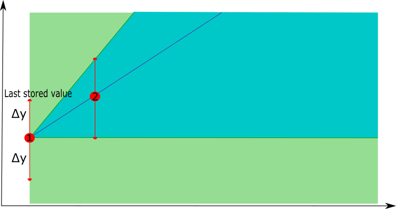
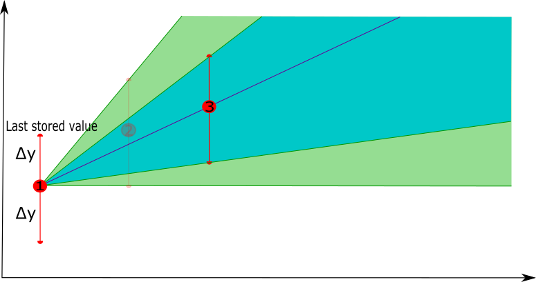
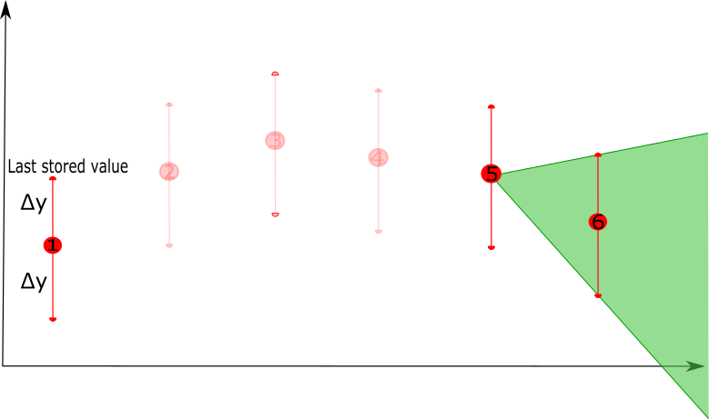

## Introduction
 
### Description

 

More and more assets are instrumented and connected, in order to collect usage and performance data such that
they can be monitored (semi-)continuously. A large number of sensors can be installed which log data in high frequency, resulting in a large amount of data being collected. Typically, these large volumes of data are transferred to a central server, where they are further analysed. This is not always optimal however:

 

- a stable communication mechanism is required which can be very expensive or is sometimes simply not available. A vehicle operating in a remote area for example doesn't always have a decent connection available, and sending huge amounts of data through a satellite connection is quite expensive.

 

- if a continuous communication mechanism is not guaranteed, the data is typically stored locally first until it can be offloaded when communication can be established. However, providing storage also has an associated cost and if data is not offloaded periodically, storage will run out and parts of the data will need to be overwritten.

 

- when data can be offloaded, e.g. a vehicle is close to a hotspot with a communication mechanism, this has to happen in a limited amount of time. Requiring a vehicle to stay with the sole purpose of offloading data is not acceptable. As such, it is not always possible to offload all data at once.

 

In such kind of situations, data compression can be applied in order to reduce the size of the data that needs to be stored or transferred. Typically, lossless data compression techniques (such as zip) are considered, but these are suboptimal: not only are they resource demanding, they also consider each data point as equally important. However, since assets rarely fail, data representing normal behaviour is available in abundant quantities, while data representing abnormal behaviour is rather rare. In most cases, the abnormal data is much more interesting to retain at a high level of detail, as a thorough analysis of the abnormality is typically performed in order to determine the root cause. More intelligent data retention methods are able to distinguish between high and low informative data, i.e. abnormal and normal usage data, and can compress the data with low informativeness to a higher degree than the data with high informativeness.

 
### Business goal

 

The business goal related to this Starter Kit is **intelligent data retention**. More specifically, we will present a technique called *Swinging Door Trending* [1] that considers the informativeness of the data in order to retain at high frequency the interesting data while reducing the frequency of the less interesting data, thereby optimally using the storage or communication means of the asset.  The level of informativeness of the data is typically linked to the application for which the data is used. In this Starter Kit, an **event detection algorithm** will be used to validate the effectiveness of the technique. An intelligent data retention technique should effectively **retain the most important data points** such that the results of the application, in this case event detection, will be the same or only slightly different at most.

 
### Application context

 

- Professional vehicles, such as cranes, trucks or airplanes, operating in remote areas without high-speed communication means

- Wearable devices with a limited amount of memory and computing power that need to transfer data to secondary devices (e.g. a mobile phone)

- Mobile industrial assets, such as compressors, that are leased and typically not connected to a company's internal internet infrastructure for safety reasons

- ...

 
### Starter Kit outline

 

We will first describe the dataset that we will be using for this Starter Kit, which consists of accelerometer data containing six time series signals. Then, we conceptually explain the Swinging Door Trending technique, and apply this on the six signals separately. Afterwards, we apply the technique on the six signals at once, which makes sense since accelerometer signals are often correlated. We then evaluate the results of both compression approaches on a technical level by considering how much they manage to compress the original signals and what is the associated error. Finally, we validate the compression within a concrete application, i.e. event detection.

 
### Dataset

 

The dataset used in this Starter Kit concerns over 100 drives of a vehicle that stores usage data while driving. The vehicle does not have a continuous communication means and thus cannot send the usage data to the centralized server continuously. Data can only be transferred when the vehicle reaches a location where a hotspot is installed to off-load the data. In this case, the hotspot is located at the entry of a parking spot, so the amount of time the vehicle is in range of the hostpot is limited, resulting in small amounts of data that can be off-loaded at once. The dataset consists of accelerometer data that is aggregated:
the raw data is sampled at 200 Hz and two aggregations are calculated and retained each second,
the **min** and **max** value.
This results in six signals, identified as **minXAcc, maxXAcc, minYAcc, maxYAcc, minZAcc** and **maxZAcc** at 1 Hz, as shown in the table below.

 
### Swinging Door Trending

 

In this Starter Kit we take a closer look at one particular state-of-the-art technique for intelligent data retention, called Swinging Door Trending (or SDT). Before applying it on our dataset, we first provide an  explanation of how it works conceptually below.

 

The SDT technique compresses a sequence of data points by using a simplified linear representation. It is computationally simple, so it can run on low-resource devices without significant overhead.

 

The technique considers an error deviation parameter Δy, which determines the error between the original signal and the compressed signal that one is willing to tolerate. The technique passes through the time series data sequentially, starting with the first two points. The first point is retained, a line is drawn between this point and the second point, and a so-called tolerance band is defined by computing the upper and lower bound, based on the deviation parameter.

 

An iterative process is started, where the technique considers the next point in the time series and verifies whether that point falls within the tolerance band. If this is the case, the point does not need to be retained and the next data point is considered. This continues until a point is reached that does not fall within the tolerance band, meaning this point cannot be represented by a linear representation between the point last retained and the current point. This last point is then also retained, and a new iterative process starts.

 

At each step, the tolerance band is also updated. When a next point is considered, its upper and lower bounds are reconsidered. The upper or lower bounds will be updated if the bounds of the next point fall below or above the previous ones, respectively, i.e. if the upper bound of the new point is lower than the previous upper bound, the upper bound is updated, and vice versa for the lower bound.  This ensures that the tolerance band will always become smaller when new points are added, since the more points, the less precise the linear representation will become.

 

The process can be illustrated by means of an example as follows.

 

- In a first phase, the technique starts with the first point in the time series, the potential tolerance band starts with the whole area after the point. When the second point is considered, a linear interpolation is constructed between these two points and the tolerance band is updated using the deviation parameter Δy.

 

<table><tr><td></td><td></td></tr></table>

 

- In a second phase, a next point is selected, the new linear representation is constructed between the last point that was retained and the next point, and the new tolerance band is defined. If the next point, i.e. point 4, has the new lower bound lower than the previous lower bound, the tolerance band is not updated (the purple area will not be used as a tolerance band update), similar for the upper bound.

 

<table><tr><td></td><td></td></tr></table>

 

- As long as there are new points that fall in the tolerance band, they can be represented by the linear representation. Once a new point is considered that falls outside the tolerance band, e.g. point 6, the last point of the linear representation, e.g. point 5, will be retained as the compressed version of points 1 to 5. Starting from point 5 a new linear representation will be constructed with point 6 as the first point to consider.  

 

<table><tr><td></td><td></td></tr></table>

 

In this example, the first 5 points will be compressed by a linear representation that is defined by point 1 and point 5, i.e. removing points 2, 3 and 4.
